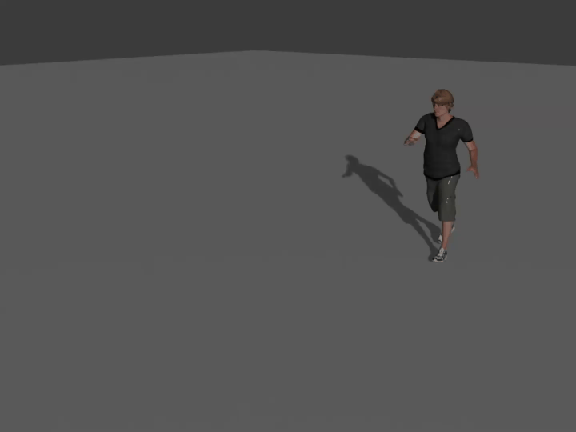
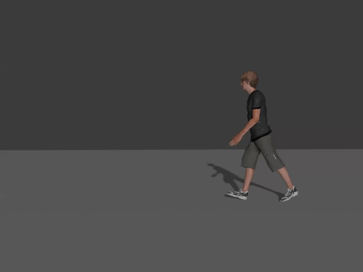
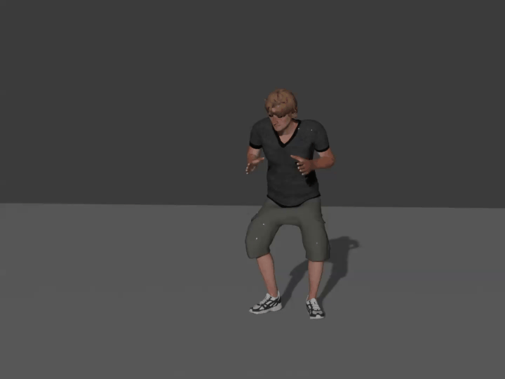
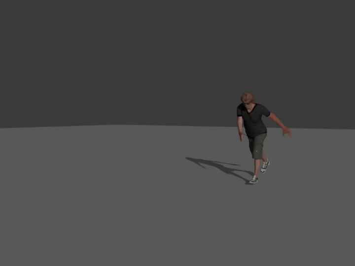
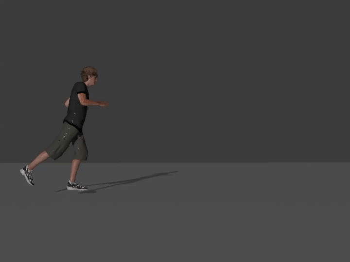
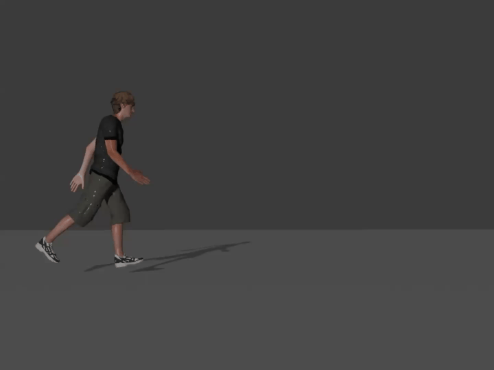

# AStF: Motion Style Tranfer via Adaptive Statistics Fusor
This is the official implementation of "AStF: Motion Style Tranfer via Adaptive Statistics Fusor"

## Visualization Results
|                                                 Style Motion                                                  | Childlike Walk      |    Netrual Walk      | Old Punch    |
|:-------------------------------------------------------------------------------------------------------------:|:----------------------------------------------------------------------------:|:-----------------------------------------------------------------------:|:----------------------------------------------------------------| 
| Content Motion  (Depressed Run)    |     |  |          |

