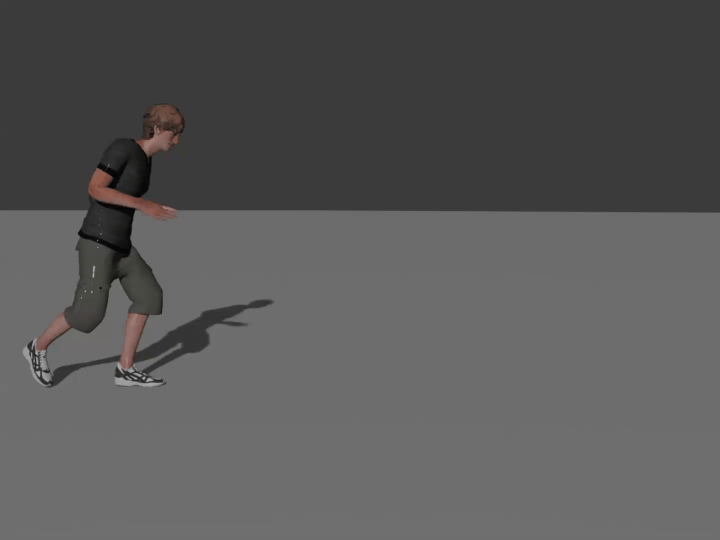
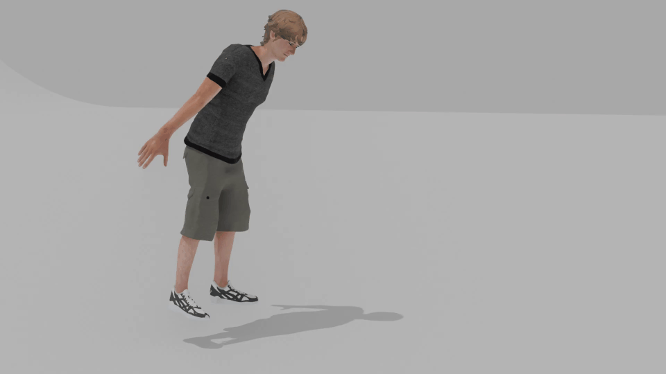
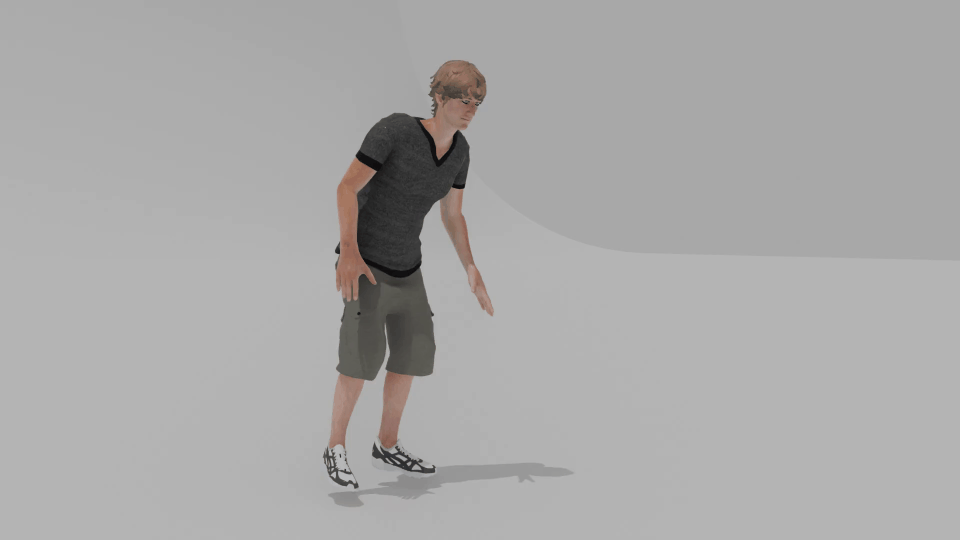
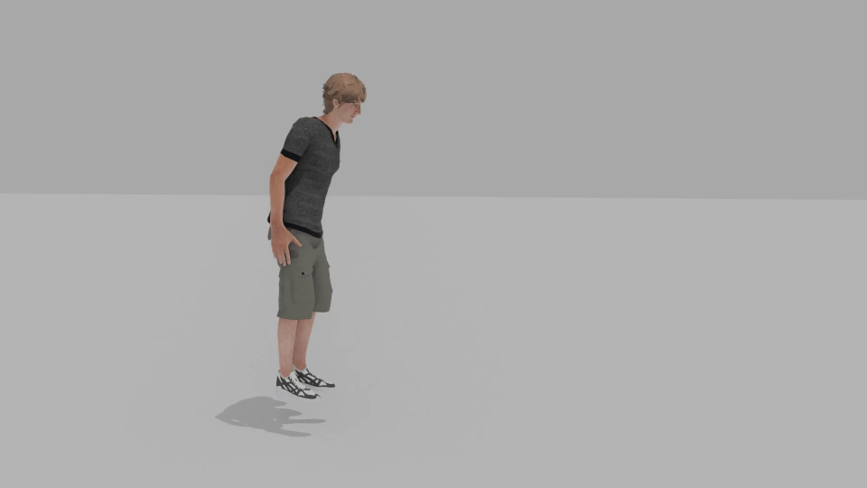

# AStF: Motion Style Tranfer via Adaptive Statistics Fusor
This is the official implementation of "AStF: Motion Style Tranfer via Adaptive Statistics Fusor"

    

Our AStF effectively transfers style between two motions, while preserving contents.

## Visualization Results in Xia dataset
|                                                 Style Motion                                                 | Childlike Walk      |    Netrual Walk      | Old Punch    |
|:------------------------------------------------------------------------------------------------------------:|:----------------------------------------------------------------------------:|:-----------------------------------------------------------------------:|:----------------------------------------------------------------| 
|       Content Motion  (Depressed Run)           |     |  |          |

|                                             Style Motion                                             |       Old Jump            |        Sexy Run         | Strutting Walk    |
|:----------------------------------------------------------------------------------------------------:|:-------------------------------------------------------------------------:|:-----------------------------------------------------------------------:|:---------------------------------------------------------------------------| 
| Content Motion  (Childlike Walk)    |  |  |         |

## Visualization Results in BFA dataset
|                            Style Motion                             |      Neutral           |          Sneaky            | Zombie              |
|:-------------------------------------------------------------------:|:------------------------------------------------------------------------:|:-----------------------------------------------------------------------:|:--------------------------------------------------------------------| 
| Content Motion  (Angry)    |                                         |  |  |

## Visualization Results for Comparison

|               Content Motion (Childlike Jump)               |                              |        
|:-----------------------------------------------------------:|:------------------------------------------------------:|
|               Style Motion (Depressed Walk)                 |  |
|                         AStF (Ours)                         |                                      |        
| MoST (Kim et al.)  |  |
| Park et al.  |  |

